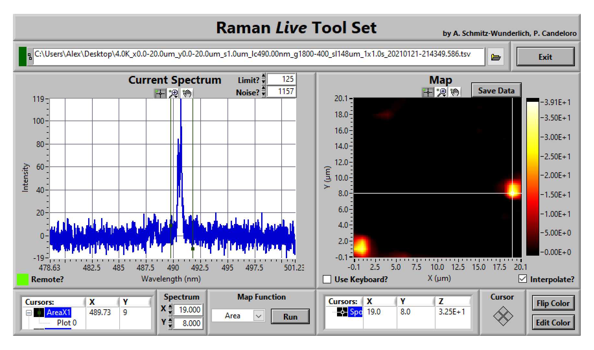

.. role:: underline
    :class: underline

.. cssclass:: title

   |front-title|

.. cssclass:: title-sub

   |front-subtitle|

**Last Update:** 08.03.2022 (v10.2.3)

This is a LabView 2010 project for displaying and evaluating spectral data from mapping applications (e.g., Raman or luminescence). 

It is specifically designed to display a live data feed of spectral data assigned to *XY* coordinates provided from a parent/sibling VI and visualizes the progress of the mapping. 

Large parts of this project are derived from the famous *Raman Tool Set* library by Patrizio Candeloro (`Analyst 138, 7331, 2013 <https://doi.org/10.1039/C3AN01665J>`_).

The original software can be found at `SourceForge <http://ramantoolset.sourceforge.net>`_.

.. contents::
   :depth: 2

.. raw:: pdf

    PageBreak docsPage

Interface
=========

This section gives an overview about all available controls and indicators.

   Frontend of the Raman *Live* Tool Set (v10.2.2) with an imported luminescence map in *area* evaluation mode and with *interpolation* turned on.

Main
----

.. list-table::
   :widths: 15 20 65
   :header-rows: 1

   * - **Element**
     - **Type**
     - **Description**

   * - :literal:`\  Exit \ `
     - .. rst-class:: table-center

       control
     - Stops the execution of the VI and closes the VI window if invoked via the executable.

   * - :literal:`\  File \ `
     - .. rst-class:: table-center

       control
     - Select a source file for importing spectral mapping data or just *drag&drop* a file into the control.

       A green LED indicator on the left side of the control is activated as long as source data are being read.

.. raw:: pdf

   PageBreak

Current Spectrum
----------------

.. list-table::
   :widths: 15 20 65
   :header-rows: 1

   * - **Element**
     - **Type**
     - **Description**

   * - :literal:`\  Limit? \ `
     - .. rst-class:: table-center

       control
     - Defines a cut-off intensity to which all spectra are limited. Defaults to *0*.

       This is useful to eleminate the influence of cosmic rays or other interfering signals on the display of the spectra and the intensity map.

       The control does not account for the value of the :literal:`\  Noise? \ ` control.

   * - :literal:`\  Noise? \ `
     - .. rst-class:: table-center

       control
     - Defines the static noise level to subtract from all spectra. Defaults to *0*.

       This is useful for increasing contrast of small and especially narrow signals in the intensity map.

       When importing data from a file, this value will automatically be set to the median value of all intensities.

   * - :literal:`\  Remote? \ `
     - .. rst-class:: table-center

       indicator
     - Indicates whether the *Toolset* is run as a standalone application (*off*) or fed live data from a remote application (*on*).

       See also `Live Data <#live-data>`_.

   * - :literal:`\  Cursors \ `
     - .. rst-class:: table-center

       indicator
     - Displays the position(s) of the data cursor(s) in the current spectrum.

       The number of cursors depends on the `Evaluation Method <#evaluation-methods>`_.

.. raw:: pdf

   PageBreak

Spectrum
--------

.. list-table::
   :widths: 15 20 65
   :header-rows: 1

   * - **Element**
     - **Type**
     - **Description**

   * - :literal:`\  X \ ` / :literal:`\  Y \ `
     - .. rst-class:: table-center

       control
     - Allows navigating to specific coordinates of the intensity map and displays the respective spectrum.

       The coordinates are displayed as the rounded values used in buiding the inensity map (see `Data Import <#data-import>`_) .

       When navigating the map by mouse or keyboard, these controls will be updated accordingly.

Map Function
------------

.. list-table::
   :widths: 15 20 65
   :header-rows: 1

   * - **Element**
     - **Type**
     - **Description**

   * - :literal:`\  Method \ `
     - .. rst-class:: table-center

       control
     - Dropdown control to select the spectral analysis method to build the intensity map from the spectra.

       See `Evaluation Methods <#evaluation-methods>`_ for details on the individual methods.

   * - :literal:`\  Run \ `
     - .. rst-class:: table-center

       control
     - Rebuilds the intensity map with the selected :literal:`\  Method \ `.

       During :literal:`\  Remote \ ` operation, the map is automatically updated with each new datapoint.

Map
---

The *Map* panel displays the current intensity map generated from the spectra with the selected evaluation method. The position of the currently displayed spectrum is indicated by a cross-hair cursor that can be dragged around by mouse to navigate the map.

Typical 2D-graph tools (like zooming) are displayed right above the map window. 

The current intensity scale is displayed on the right.

.. list-table::
   :widths: 25 20 55
   :header-rows: 1

   * - **Element**
     - **Type**
     - **Description**

   * - :literal:`\  Save Data \ `
     - .. rst-class:: table-center

       control
     - Stores the current intensity map as a tab-separated file to the hard drive.

       Interpolated values will not be exported.

       The file path can be chosen by a user dialog and defaults to a subdirectory *Map* at the source file.

   * - :literal:`\  Use Keyboard? \ `
     - .. rst-class:: table-center

       control
     - Enables navigating the map via the keyboard array keys.

   * - :literal:`\  Interpolate? \ `
     - .. rst-class:: table-center

       control
     - Enables linear interpolation of the intensity map. The level of interpolation is curently hard-coded at a value of *3*, i.e. 

       This setting will not affect data saved via the :literal:`\  Save Data \ ` button.

   * - :literal:`\  Flip Color \ `
     - .. rst-class:: table-center

       control
     - Inverts the intensity color scale of the map.

   * - :literal:`\  Edit Color \ `
     - .. rst-class:: table-center

       control
     - Opens a user dialog to switch or adjust the intensity map color scale.

       .. rst-class:: figure-tight

       .. figure:: ../img/edit-color.png
          :width: 7cm
          :align: center
          :alt: Raman *Live* Tool Set Edit Color Dialog

   * - :literal:`\  Cursors \ `
     - .. rst-class:: table-center

       indicator
     - Displays the current position of the cross-hair cursor in the intensity map.

Data Source
===========

Map data can be loaded into the *Toolset* from a text file or by live-feeding from another VI.

In both cases, the XY cordinates will be projected onto linear axes by interpolating to achive uniform display of the intensity map.

This interpolation does not affect the data stored during export of the map.

Files
-----

The primary way to import data into the *Toolset* is to open a tab-separated text file via the :literal:`\  File \ ` control.

There are some requirements for the data to be loaded correctly:

* the file *may* have any number of header rows containing string values

* the decimal separator *must* be a '**.**' (dot)

* data columns *must* be seperated by a **tab**

* the first column *must* contain the x-axis (e.g., wavelength)

* the first two rows *must* contain the X- and Y-coordinates of the map

* spectra *must* be stored in the column below their respective XY coordinates

* the first two rows of the first data column *can* contain any data

Note that the *Toolset* will not adjust the displayed graph axes titles.

Live Data
----------

The *Toolset* can also handle partial maps which is essentially useful for displaying live data during the mapping process.

The live monitoring can only be used as a sub-VI or sub-panel, the executable does not support live data.

To achieve this functionality, the VI connector has three connectable terminals:

.. list-table::
   :widths: 20 80
   :header-rows: 1

   * - **Terminal**
     - **Description**

   * - :literal:`\  Remote? \ `
     - When the *Toolset* ist used to monitor live data, this connector must be set to *true* during the invokation of the VI.

   * - :literal:`\  Exit \ `
     - Connected to the :literal:`\  Exit \ ` control to allow closing the *Toolset* from a parent VI.

   * - :literal:`\  Live Data \ `
     - Connected to a hidden 2D array control with datatype *double*.

       The expected data format follows the structure described in `Files <#files>`_.

The values of the :literal:`\  Live Data \ ` and :literal:`\  Exit \ ` connectors are polled for changes every 100ms and trigger a recalculation of the intensity map if the input data have changed.

This way, the intensity map is build up pixel-by-pixel during an (externally) controlled spectroscopic mapping process.

Evaluation Methods
==================

The *Toolset* supports different evaluation methods to build the intensity map from the raw spectra.
For all methods, the settings of the :literal:`\  Noise? \ ` and :literal:`\  Limit? \ ` controls will be respected, see `Spectrum <#current-spectrum>`_.
The intensity map will be recalculated by pushing the :literal:`\  Run \ ` control or whenever :literal:`\  Live Data \ ` are updated.

Changing the :literal:`\  Method \ ` control will display different numbers of data cursors in the spectrum pane.
The boundaries for the evaluation methods can be adjusted by moving the cursors with the mouse.

The following methods are available:

.. list-table::
   :widths: 15 15 70
   :header-rows: 1

   * - **Method**
     - **Cursors**
     - **Description**

   * - :literal:`\  Total \ `
     - .. rst-class:: table-center

       0
     - Calculates the total sum of all datapoints in the spectrum. 

   * - :literal:`\  Peak \ `
     - .. rst-class:: table-center

       2
     - Determines the absolute peak intensity value between the cursors.

   * - :literal:`\  Area \ `
     - .. rst-class:: table-center

       2
     - Calculates the sum of all datapoints between the cursors.

   * - :literal:`\  Value \ `
     - .. rst-class:: table-center

       1
     - Returns the intensity value of the datapoint at the current cursor position.

   * - :literal:`\  Ratio \ `
     - .. rst-class:: table-center

       2
     - Calculates the intensity ratio between the datapoints at the current cursor positions. 

.. ######################### Definitions ######################### ..

.. sectnum::
    :depth: 3

.. header::

   .. rst-class:: headertable

   .. list-table::
      :width: 100%
      :header-rows: 0

      * - .. rst-class:: headerbody-sup

          |title-sup|

          .. rst-class:: headerbody

          |title|

.. footer::

   .. rst-class:: footertable

   .. list-table::
      :width: 100%
      :widths: 80 20
      :header-rows: 0

      * - .. rst-class:: footerbody-left

          |copy| 2021-2022 Alexander Schmitz-Wunderlich, University of Duisburg-Essen

        - .. rst-class:: footerbody-right

          ###Page### of ###Total###

.. |front-title|     replace:: Raman *Live* Tool Set 
.. |front-subtitle|  replace:: User Guide

.. |title-sup|  replace:: Using
.. |title|      replace:: Raman *Live* Tool Set 

.. |copy|   unicode:: U+000A9 .. COPYRIGHT SIGN